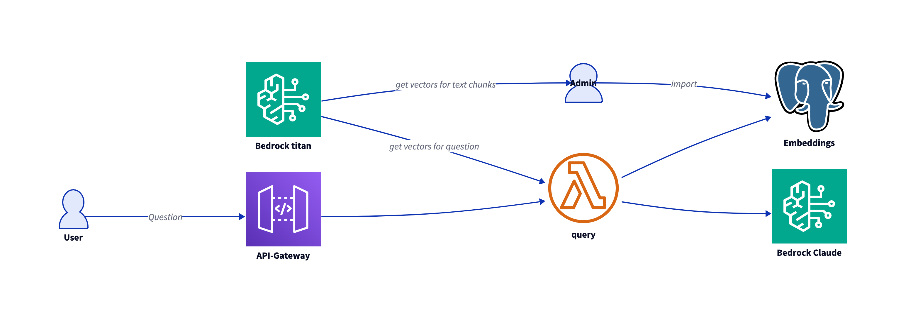

# API for RAG with embedding



## Manually create RDS/postgres

Minimal Version 15.3

## Import

See directory `import`.


## Deploy API

```bash
cd api
task build 
task deploy
```

## Test

In Postman:

- Get URL from SAM output
- Put API Gateway API Key as autorization header X-API-Key
- Method POST

Body raw:

```json
{
    "question": "This is my question?"
}
```

## Include in Webserver

Example for python:

```python
import requests
    url = os.getenv("API_URL")
    key = os.getenv("API_KEY") 
    # --------
    headers = {
        "X-API-Key": key,
    }
    data = {
        "question": f"{input}",
    }
    logging.debug(f"Query: {data}", data)
    response = requests.post(url, json=data, headers=headers, timeout=90)

```
